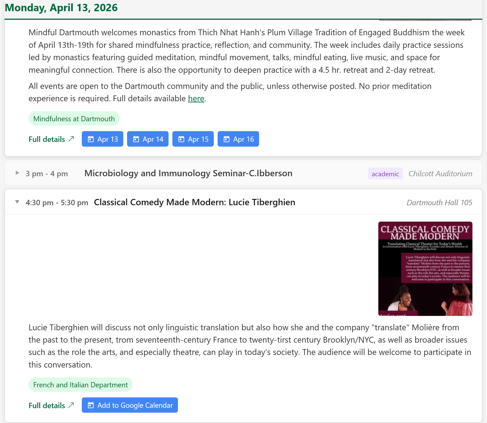

# Upper Valley Events Scraper

Scrapes upcoming public cultural events from several Upper Valley (VT/NH) websites into one big
page with Google Calendar buttons.

**Sources:**
- [home.dartmouth.edu/events](https://home.dartmouth.edu/events)
- [nhhumanities.org/programs/upcoming](https://www.nhhumanities.org/programs/upcoming)
- [northernstage.org](https://northernstage.org) (theater)
- [shakerbridgetheatre.org](https://www.shakerbridgetheatre.org) (theater)
- [nugget-theaters.com](https://www.nugget-theaters.com) (Nugget Theater, Hanover)
- [entertainmentcinemas.com/lebanon-6](https://www.entertainmentcinemas.com/lebanon-6) (Lebanon 6)



## Requirements

```
pip install requests beautifulsoup4
```

Python 3.9+ required.

## Usage

```
python scraper.py [--sources=SOURCES] [--days=N]
```

`--sources` accepts a comma-separated list of sources or groups:
- `all` — all sources
- `theater` — `northernstage`, `shakerbridgetheatre`
- `movies` — `nugget`, `lebanon6`
- individual: `dartmouth`, `nhhumanities`, `northernstage`, `shakerbridgetheatre`, `nugget`, `lebanon6`

### Examples

Regenerate HTML from cached data (no network calls):
```
python scraper.py
```

Scrape everything and regenerate:
```
python scraper.py --sources=all
```

Scrape only nhhumanities with a 60-day window, then regenerate all:
```
python scraper.py --sources=nhhumanities --days=60
```

## Intermediate files

Scraped data is stored as JSON in `output/` before HTML generation:

| Source | File |
|---|---|
| Dartmouth | `output/scraped_dartmouth.json` |
| NH Humanities | `output/scraped_nhhumanities.json` |
| Northern Stage | `output/scraped_northernstage.json` |
| Shaker Bridge | `output/scraped_shakerbridgetheatre.json` |
| Nugget Theater | `output/scraped_nugget.json` |
| Lebanon 6 | `output/scraped_lebanon6.json` |

This lets you re-generate the HTML (e.g. to tweak styling) without re-fetching all event pages.

